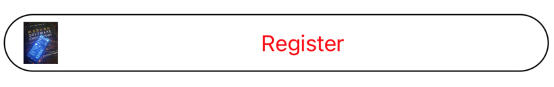

# CustomButton

Here is a smaple of when you just have `title`

Here is a smaple of when you have `title` and `subtitle`

Here is a smaple of when you have `title`, no `subtitle`, for the `icon` you have netered something that doesn't exist. an UIImage will be generated and shown as the square blue in the following screenshot.

Here is a smaple of when you have `title`, no `subtitle`, for the `icon` you have entered the name of an image in asset catalog. 

Here is a smaple of when you have `title`, no `subtitle`, for the `icon` you have entered the name of an SF Symbol. the one shown here is `square.and.arrow.up.circle.fill`. 
